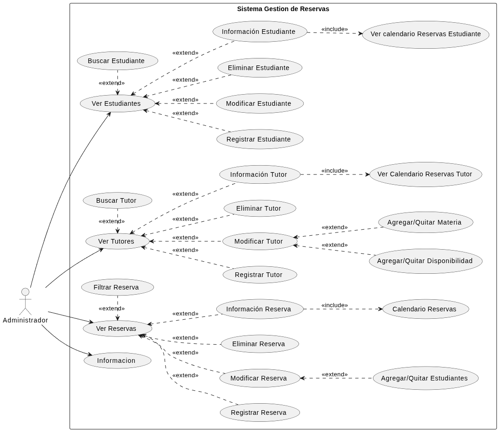
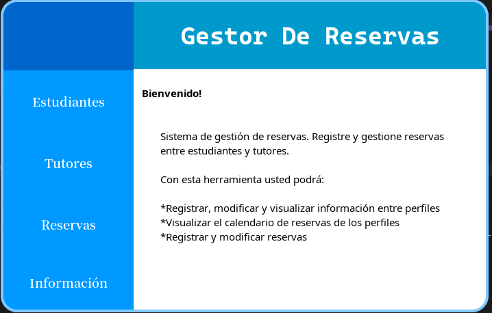
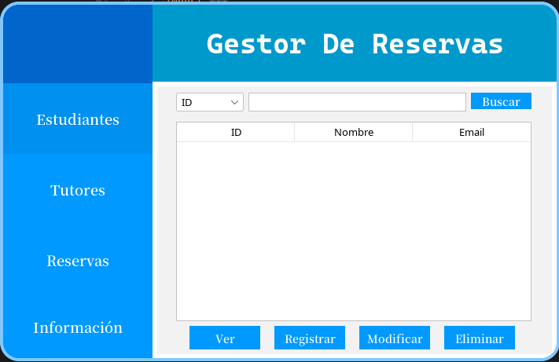
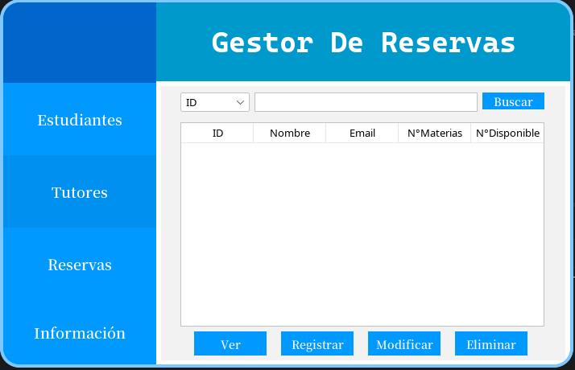
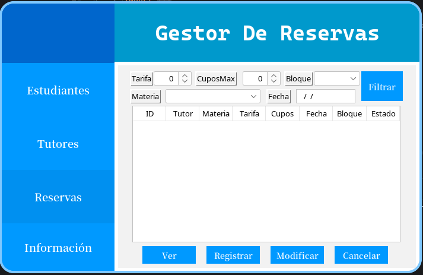
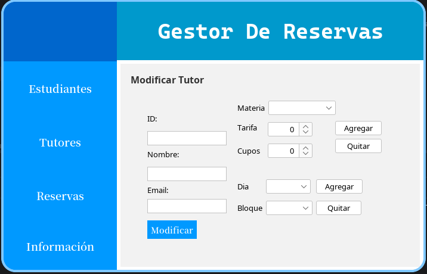
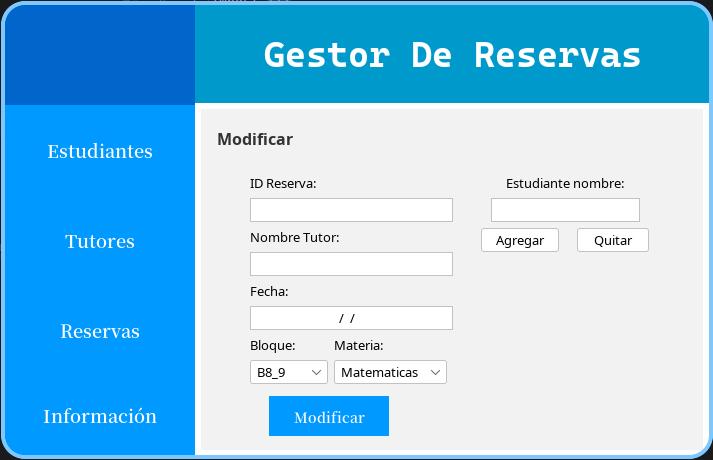
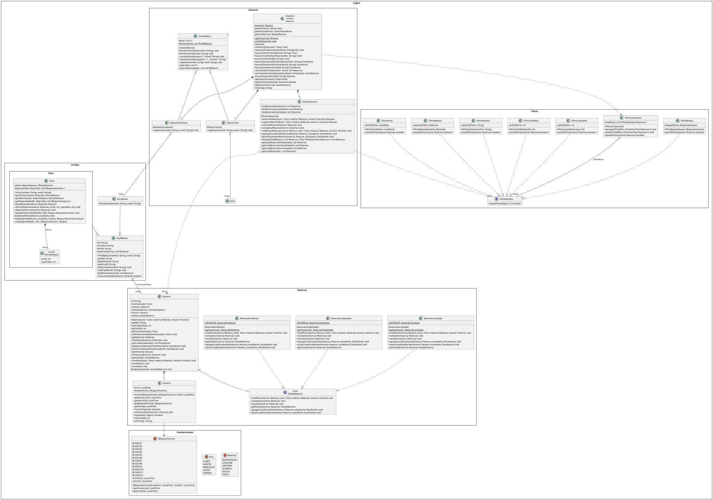
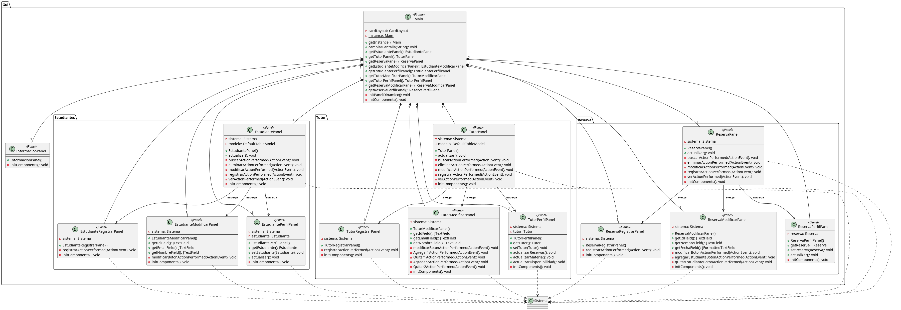

# Class-Booking-System

**Desarrollador:**
* Martín Nicolás Parra Polanco

## 1. Enunciado del Proyecto
Este sistema está diseñado como una herramienta interna para que un administrador gestione eficientemente las reservas de clases particulares o tutorías. El administrador podrá crear y mantener perfiles detallados de los tutores, incluyendo las materias que imparten, sus tarifas, la cantidad máxima de estudiantes por materia y sus bloques de horarios de disponibilidad. De igual forma, el administrador registrará y gestionará la información de los estudiantes que solicitan el servicio. Cuando se reciba una solicitud de clase, el administrador utilizará el sistema para buscar horarios y tutores compatibles con las necesidades del estudiante. Una vez encontrada una opción adecuada, el administrador creará la reserva directamente en el sistema, asignando al estudiante con el tutor en el horario específico. El sistema deberá prevenir conflictos horarios y mantener un "calendario" de las clases programadas, con vistas filtradas para cada tutor o estudiante. Además, el administrador se encargará de procesar modificaciones o cancelaciones de clases.

## 2. Diagrama de Casos de Uso

## 3. Interfaz Gráfica

## 4. Diagrama de Clases UML

## 5. Patrones de Diseño Implementados y Justificación

### 5.1. Facade
* **Justificación:** Se decidió aplicar un punto de entrada centralizado (clase Sistema) que coordine los algoritmos del proyecto, con el objetivo de garantizar un código más sencillo a la hora de integrar funcionalidades y también como forma de desacoplar los diferentes gestores entre sí. Adicionalmente, se prefirió incorporar getters de los gestores para conseguir puntos de acceso más específicos (buscando facilitar el acceso a métodos), mientras que la clase Sistema tiene métodos que coordinan todos los gestores en un solo lugar.
* **Clases Involucradas:** Sistema

### 5.2. Singleton
* **Justificación:** La clase Sistema es un singleton para evitar que se genere un "nuevo sistema", puesto que esta aplicación no tendría sentido duplicada en el proyecto. Además, se decidió que los estados de las reservas siguieran el patrón singleton para evitar tener que instanciar un estado cada vez que se necesite, bajando así el acoplamiento, mejorando la legibilidad del código y siguiendo la lógica de que un estado se comporta de la misma manera en cada reserva.
* **Clases Involucradas:** Sistema, ReservaCompletada, ReservaPendiente, ReservaCancelada

### 5.3. Strategy
* **Justificación:** Para evitar rellenar de "ifs" el filtrado de reservas, se decidió aplicar un patrón Strategy que modelara los comportamientos de los filtros uno por uno en diferentes clases. Esto permitió no sobrecargar la GUI con complejidad lógica; en cambio, esta solo tendría que llamar a la estrategia correspondiente, y esta se encargaría de la lógica, bajando el acoplamiento.
* **Clases Involucradas:** FiltroBloque, FiltroCompuesto, FiltroCuposMax, FiltroFecha, FiltroMateria, FiltroNombre, FiltroTarifaMax, FiltroInterface (Interface)

### 5.4. State
* **Justificación:** Una reserva debería ser capaz de poseer un estado actual y comportarse en consecuencia; por ejemplo, en un estado "cancelado" la reserva no debería recibir más estudiantes, a diferencia de un estado "pendiente". Por tanto, se prefirió el patrón State para indicar los estados de las reservas sin recurrir a ifs o switch cases. Actualmente solo se poseen tres estados, pero con este patrón de diseño, implementar estados nuevos como "pago pendiente" o "fecha por definir" resulta bastante cómodo, ya que respeta el principio "abierto/cerrado" de los principios SOLID.
* **Clases Involucradas:** EstadoReserva (Interface), ReservaCancelada, ReservaCompletada, ReservaPendiente

## 6. Decisiones Importantes del Proyecto
A medida que se fue extendiendo el proyecto, fueron apareciendo diversas dificultades y, debido a eso, fue necesario tomar decisiones importantes. Algunas de ellas fueron:

* **Creación de disponibilidad del tutor:** En un inicio, se esperaba agregar la fecha exacta de disponibilidad del tutor; no obstante, esta forma de funcionar rápidamente resultaría en un flujo engorroso y poco automatizado. Por tal razón, se prefirió que cada tutor tuviera una disponibilidad basada en bloques y días de la semana, lo que significa que el administrador conoce los días preferentes del tutor y, de esta manera, se facilita la comunicación y la selección de un tutor asociado a la reserva.

* **Eliminación del patrón MVP:** Una vez comenzado el desarrollo de la GUI, se pensó de inmediato en usar el patrón MVP para bajar el acoplamiento del "presentador" respecto a la lógica. No obstante, tras analizar la situación, se llegó a la conclusión de que aplicar este patrón de diseño solo llevaría al antipatrón "código ravioli", puesto que la interfaz gráfica de por sí no presenta mucha complejidad lógica y segmentar más el código lo complejizaría innecesariamente. Por tanto, se optó por mantener un modelo más simple.

* **Uso de NetBeans para la GUI:** El desarrollo de la interfaz gráfica con NetBeans nació de la necesidad de mantener una interfaz estética y funcional dividida en módulos. De esta manera, el IDE permitió segmentar correctamente las partes de la interfaz gráfica y mantener una estética adecuada para el proyecto. No obstante, se reconoce que esta herramienta generó bastante verbosidad en la interfaz gráfica, algo que, para la complejidad del proyecto, no resultó perjudicial. Sin embargo, en otra situación podría haber generado muchos inconvenientes; para el alcance de este proyecto en particular, la herramienta fue acertada.

## 7. Problemas Identificados y Autocrítica
A pesar del poco tiempo disponible para terminar el proyecto, se dedicó muy poco tiempo a la estructuración del sistema, lo que significa que gran parte de la arquitectura fue implementada sobre la marcha, dificultando en gran medida un avance fluido. De haber dedicado más tiempo a la arquitectura, el proyecto probablemente habría terminado antes. Por otro lado, al tratarse de un sistema centralizado en el administrador, encontrar un enfoque que hiciera útil a la aplicación cumpliendo las indicaciones del enunciado resultó complicado, pues, al existir otras herramientas más eficientes, diferenciarse y lograr un proyecto verdaderamente funcional fue un desafío.

Finalmente, a modo de autocrítica, se cree que el uso de inglés para los packages y los commits, y de español para el resto, generó cierta incoherencia en el proyecto. En un inicio se pensó en dejar el proyecto completamente en inglés (por convención); no obstante, debido al tiempo y al desgaste que implicaba la traducción, se prefirió este enfoque mixto. Se espera que en un futuro cercano el proyecto pueda redactarse íntegramente en uno de los dos idiomas. Por otro lado, al tratarse de un proyecto individual, se tomó la libertad de hacer commits más grandes centrados en una única tarea; sin embargo, se entiende que en un proyecto con colaboradores los commits deberían ser más concretos.

## 8. Propuestas de Mejora
Debido al poco tiempo para realizar el proyecto (en este caso, se desarrolló en poco menos de dos semanas), varias ideas prometedoras quedaron de lado. Por esa razón, para futuras versiones de este proyecto (que seguramente se desarrollen en los próximos años) se proponen los siguientes ejes de mejora:

* **Incorporación de nuevos estados para las reservas:** Considerando que estas reservas son de pago, sería interesante agregar un estado de "pago pendiente" para cuando algún estudiante no haya pagado la reserva. De esta manera, también debería existir un registro de pago en la visualización de los perfiles.

* **Implementación de una API REST:** Sería interesante implementar una API REST que se conectara con una base de datos para mantener actualizada la información de los perfiles y reservas.

* **Creación de un calendario dinámico de reservas:** Actualmente, el calendario de reservas se visualiza mediante una tabla; no obstante, sería prometedor crear un calendario navegable donde se visualicen las reservas, haciendo el programa más accesible y reduciendo el ruido visual.